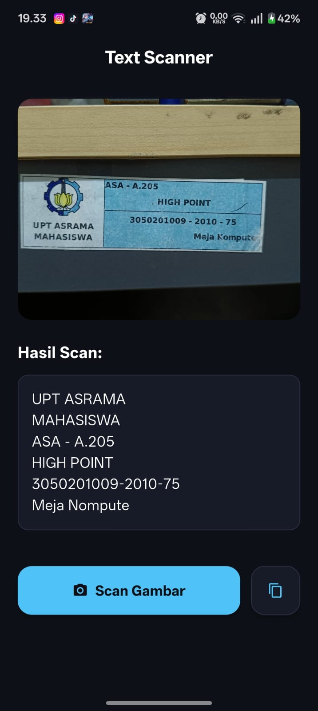

# Mobile Programming E4
## Flutter Text Scanner

Aplikasi pemindai teks (OCR) sederhana yang dibangun menggunakan Flutter dan Google ML Kit. Aplikasi ini memungkinkan pengguna untuk mengambil gambar dari kamera atau memilih dari galeri dan mengekstrak teks di dalamnya secara instan.

- **OCR Engine**: [Google ML Kit Text Recognition](https://developers.google.com/ml-kit/vision/text-recognition)

## Cara Penggunaan

1. Buka aplikasi.
2. Klik tombol **"Scan Gambar"** di bagian bawah.
3. Pilih sumber gambar (Kamera atau Galeri).
4. Tunggu proses pemindaian selesai.
5. Gunakan tombol **ikon copy** untuk menyalin teks hasil scan.

